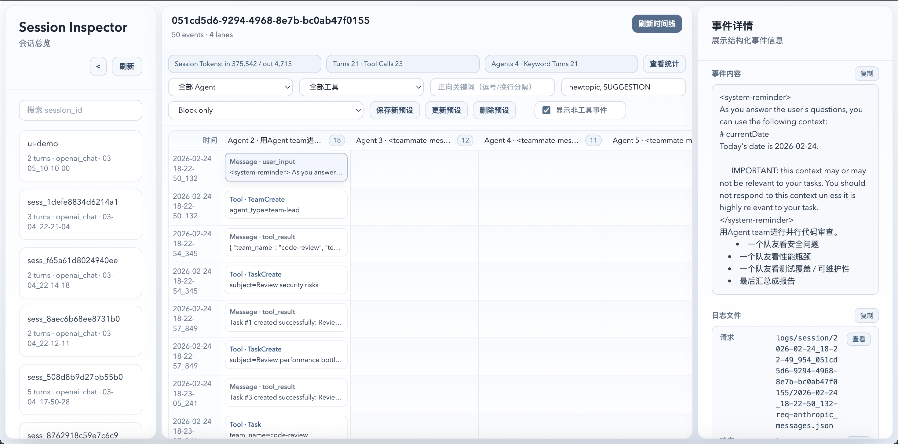
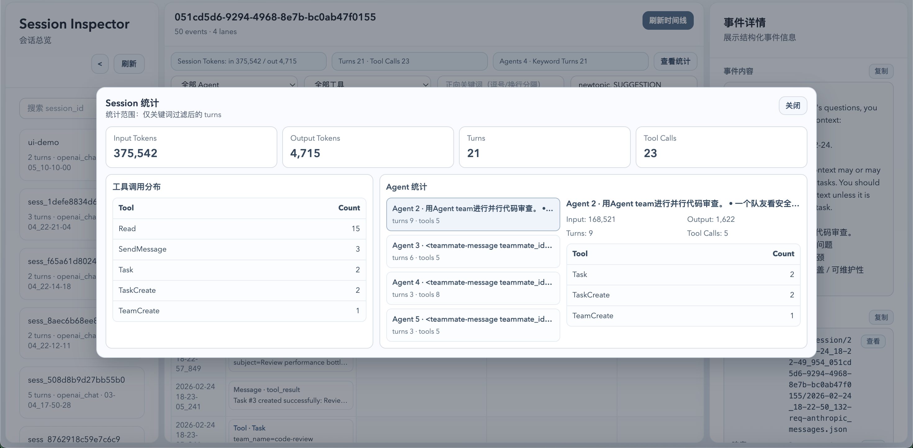

# LLM_Bridge：把多上游 LLM、协议转换和 Agent 可观测性收敛到一个入口

<p align="center">
  
</p>

<p align="center">
  <a href="README.md">
    
  </a>
  <a href="https://deepwiki.com/Mrchen116/LLM_Bridge">
    
  </a>
</p>




面向 Agent / Coding Assistant 场景的多上游 LLM 代理层。它把多个模型提供方、多个 Codex OAuth 订阅账号、三种常见协议入口，以及运行日志与会话观测能力统一到同一个服务里。

当前支持的统一入口：

- Anthropic Messages：`/v1/messages`
- OpenAI Chat Completions：`/v1/chat/completions`
- OpenAI Responses：`/v1/responses`

你可以把它理解成一个专门给 Agent 系统准备的 LLM Gateway：

- 对外暴露稳定的单一入口，对内按 `profile:model` 路由到不同上游
- 把多个 Codex 订阅整理成可切换、可失败转移的账号池
- 在 `Anthropic Messages`、`OpenAI Chat Completions`、`OpenAI Responses` 三种协议之间做桥接与转换
- 为多 Agent 运行保留完整轨迹，并提供可视化分析界面
- 遇到 `406` / `429` 等限流或临时失败时自动重试，尽量避免 Agent 中断

## 这个项目适合解决什么问题

- 你需要统一管理多个上游 LLM API，而不是把密钥、模型和协议分散写死在各个 Agent 工具里
- 你有多个 Codex 订阅，希望组成资源池，在限流、过期或单账号不稳定时自动切换
- 你想让只会说一种协议的客户端，接入另一种协议的模型或内网服务
- 你需要观察多 Agent 并发执行过程，定位工具调用、上下文漂移、失败点和 token 消耗
- 你想采集黑箱 Agent 运行轨迹，把请求、响应、工具调用和会话结构沉淀下来，用于 SFT 或 RL 数据准备

## 核心优势

- 统一多上游管理：一个服务入口统一接入商业模型、内网模型和 Codex OAuth 账号池
- 三协议互通：支持 `Anthropic Messages`、`OpenAI Chat Completions`、`OpenAI Responses` 相互桥接
- 兼容主流 Agent：可以用 Codex 订阅去承接 Claude Code 风格请求，也能把只有单一协议的内网部署暴露给不同 Agent 客户端使用
- 多 Agent 轨迹可视化：内置 Session Inspector，可直接查看 lane 时间线、工具参数、工具定义、摘要事件和原始日志
- 黑箱轨迹采集：会话日志默认落盘，便于回放、审计、故障分析和训练数据整理
- 限流韧性：对 `406` / `429` 自动指数退避重试，并支持 Codex OAuth 账号失败转移
- 保留工程可用性：支持 SSE 流式与非流式透传，便于直接挂在现有 Agent 框架前面

## 功能特性

- 按 `profile:model` 动态选择上游与默认模型
- 支持 Codex OAuth 本地账号池管理与请求级失败转移
- 支持流式（SSE）与非流式透传
- 可选屏蔽 Task 工具描述中的 `- Explore:` 行
- 支持会话日志与统计接口（session logs + token 聚合）
- 内置 Session Inspector：
  - 多 agent lane 时间线展示
  - 工具调用参数与工具定义（name/description/schema）查看
  - 非工具事件摘要查看
  - 日志文件原文弹窗查看（支持“渲染换行 / 原始文本”模式切换）

## 环境要求

- Python 3.10+

依赖已写入 `requirements.txt`。

## 快速开始

1. 安装依赖

```bash
python -m venv .venv
source .venv/bin/activate
pip install -r requirements.txt
```

2. 配置环境变量（示例）

```bash
export MOONSHOT_API_KEY="your_key"
export PROXY_HOST="127.0.0.1"
export PROXY_PORT="4000"
```

如果使用 `codex_oauth` profile，请先登录本地账号池（不再支持 `CODEX_ACCESS_TOKEN` / `CODEX_ACCOUNT_ID` 环境变量直传）：

```bash
python manage_codex_accounts.py add --label work --method browser
python manage_codex_accounts.py list
# 或直接进入交互式向导：
python manage_codex_accounts.py
```

3. 启动服务

```bash
python start_proxy.py
```

可选参数：

- `--ban_explore`：移除 Task 工具描述中的 `- Explore:` 行
- `--ban_stream`：禁用 `/v1/messages` 流式请求
- `--ui`：启用 Session Inspector UI 与 API
- `--open-ui`：启用 UI，并自动打开浏览器（`/ui/session-inspector`）

## Session Inspector（多 Agent 会话分析）

启用方式（二选一）：

- 环境变量：`export ENABLE_SESSION_INSPECTOR_UI=true`
- 启动参数：`python start_proxy.py --ui` 或 `python start_proxy.py --open-ui`

访问地址：

- 页面：`GET /ui/session-inspector`
- 静态资源：`/ui/session-inspector/assets/*`

### Agent Lane 判定规则（当前实现）

每个 turn 会先被转换到统一上下文（Responses 风格），然后按以下规则聚类 lane：

1. 先提取上下文键：`instructions`、`input`、`tools`、`tool_choice`、`reasoning`、`include`
2. 去掉当前 turn 最后一个 user suffix，只保留“当前请求之前的完整前缀”
3. `static_key` 只基于 `input` 之外的静态上下文 + `provider` + `model`
4. 在同 `static_key` 下，若“某已知 lane 的前缀”是“当前前缀”的前缀，则归入该 lane
5. 若没有命中，则创建新 lane

这保证了多 agent 并发场景下，能按历史前缀链和工具/系统上下文稳定区分 agent。

### 事件与详情

- 时间线事件类型：
  - `user_input`
  - `assistant_text`
  - `assistant_reasoning`
  - `tool_call`
  - `response_status`
- 事件详情可查看：
  - 事件摘要与完整内容
  - 工具参数
  - 工具定义（名称 / 描述 / 参数 schema）
  - 对应日志文件路径（request / response / non_stream / downstream）
- 日志文件弹窗支持：
  - `渲染换行`：将 `\n` 等转义序列按可读文本显示
  - `原始文本`：保留 JSON 原始字面量展示

## 上游配置

默认读取 `upstreams.json`，可用 `UPSTREAM_CONFIG_PATH` 覆盖路径。

关键字段：

- `defaultProfile`：默认上游 profile
- `profiles.<name>.provider`：`openai_compatible` / `anthropic` / `codex_oauth`
- `profiles.<name>.capabilities.ingress`：允许的入口协议
- `profiles.<name>.defaults.model`：默认模型

模型支持 `profile:model` 写法，例如：

- `moonshot:kimi-k2.5`
- `codexOAuth:gpt-5.2-codex`

## API 列表

- `GET /health`：健康检查
- `POST /v1/messages`：Anthropic Messages 入口（可桥接到 OpenAI 兼容上游）
- `POST /v1/messages/count_tokens`：token 估算
- `GET /session/{session_id}/stats`：会话统计
- `POST /v1/chat/completions`：OpenAI Chat Completions 入口
- `POST /v1/responses`：OpenAI Responses 入口

Session Inspector API（仅在 UI 启用时可用）：

- `GET /api/session-inspector/sessions`
- `GET /api/session-inspector/sessions/{session_id}/timeline`
- `GET /api/session-inspector/log-file?path=<logs/session 下的文件路径>`

`/api/session-inspector/log-file` 只允许读取 `logs/session` 目录内文件。

## 前端开发（Session Inspector）

前端位于 `frontend/session-inspector`（React + TypeScript + Vite）。

```bash
cd frontend/session-inspector
npm install
npm test
npm run build
```

构建产物会输出到后端静态目录 `src/inspector_ui/`，由 FastAPI 直接托管。

## 日志目录

运行后会在 `logs/` 下生成这些目录：

- `logs/session/`：按会话聚合的 turn 日志，供 Session Inspector 使用
- `logs/raw/`：原始请求、上游请求、响应和 headers 落盘，按 bucket 分组，例如 `anthropic`、`openai_chat`、`openai_codex`

## 测试

```bash
pytest -q
```
